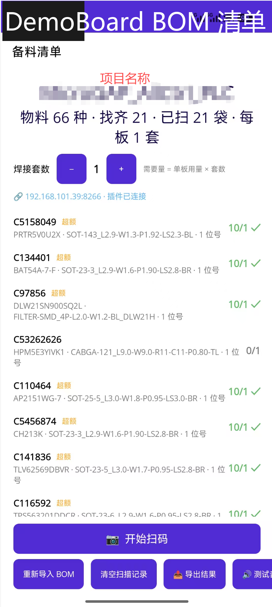
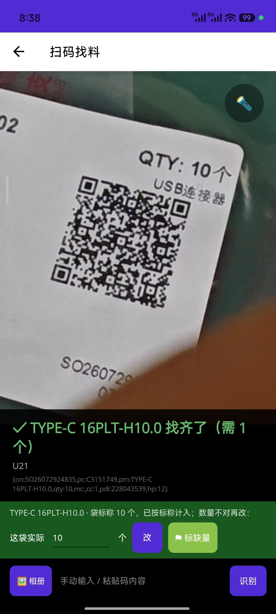
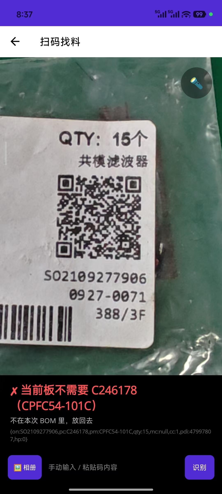
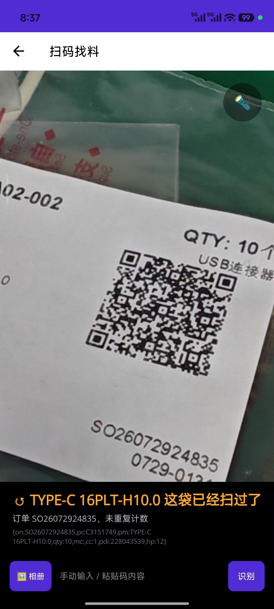

# BOM 找料助手 · LCEDA-bom-search-app

安卓扫码备料 App（.NET MAUI）：导入立创 EDA 的 BOM，翻元件袋时**逐袋扫二维码**，
靠声音和振动判断「这袋要不要、要几个、还差哪些」——不用盯着屏幕核对 BOM 表。
配合立创 EDA 扩展 [LCEDA-pcb-solder-link](https://github.com/liuem/LCEDA-pcb-solder-link)
可一键接收 BOM 下发，并在电脑端实时高亮当前扫描物料的焊接位置。

## 解决什么问题

SMT 手工备料时最常见的低级错误：拿错料、漏拿料、数量不够焊到一半才发现。
人工对着 BOM 表逐行核对又慢又容易走眼。本 App 把核对动作压缩成「扫一下」：

- **要** → 上扬「叮咚」+ 短振动，屏幕显示这袋标称数量与已扫累计；
- **不要** → 低音「嘟」+ 中振动，放回去；
- **扫过了** → 双击提示音，不重复计数；
- 一行扫齐 → 叮咚升级版；全部找齐 → 长振动 + 欢快提示。

全程可以不看屏幕，听声音翻袋即可。

## 功能演示

| BOM 清单与进度 | 找到需要的元件 |
| --- | --- |
|  |  |

| 当前板不需要 | 同袋重复扫 |
| --- | --- |
|  |  |

## 使用

1. 立创 EDA 专业版 → 顶部菜单「组装 → 导出 BOM」，保存 CSV/xlsx；
2. App 主页「导入 BOM 文件」选择该文件（支持 CSV UTF-16/TSV、xlsx、JSON）；
3. 设置套数（多板拼贴时按倍数累计用量）；
4. 「开始扫码」进入相机页，逐袋扫描袋子上的**二维码**（含 C 编号与标称数量）；
   - 命中后默认按袋标称计入，数量不对时在底部修正条里改；缺料可标 ⚑；
   - 搜出来的元件袋支持**捏合变焦**、双击复位、点击对焦；扫不出码时自动补对焦；
5. 找齐后「导出结果」生成 CSV（完整清单 / 缺料清单）复核。

### 与 EDA 插件联动（可选）

手机与电脑同一局域网，App 主页顶部会显示 `ws://IP:8266` 连接地址：
在 EDA 扩展「焊接助手联动」的设置里填入该地址，即可从 PCB 菜单一键下发 BOM；
之后每次扫码，电脑端自动交叉高亮该物料的全部位号并定位视口。

## 技术要点

- **扫码引擎**（`Platforms/Android/FastScanHandler.cs`）：替换 ZXing.Net.Maui 默认
  Android 处理器——预览 1600×1200 / 解码流 1920×1440（默认 640×480 画面糊、码要凑很近）、
  Camera2Interop 显式连续自动对焦、二维码解码单遍无旋转重试 + 缓冲零分配、
  定位角驱动**自动变焦**（扫到小码自动放大到半幅宽，光学优先）。
- **联动服务器**（`Services/LinkServer.cs`）：手写 HTTP + RFC6455 WebSocket 服务端
  （同端口 8266），大消息自动分片；扫码/记账事件实时推送给 EDA 插件。
- 只认袋面**二维码**（一维物流条码不响应）；数据全部本地存储，无任何云端依赖。

## 构建

```bash
dotnet build -t:Install -c Debug -f net10.0-android   # 构建并安装到已连接的设备
```

- 需要 .NET 10 SDK + Android 工作负载；首次运行需授予相机权限；
- 注意：Debug 包使用快速部署，手动 `adb install` 装 Debug APK 会因缺程序集闪退，
  一律用上面的 `-t:Install` 目标部署；
- 扫码与音效目前按安卓实机调校；Windows 目标仅作 UI 模拟（可用输入框粘贴码内容测试流程）。

## License

Apache-2.0
